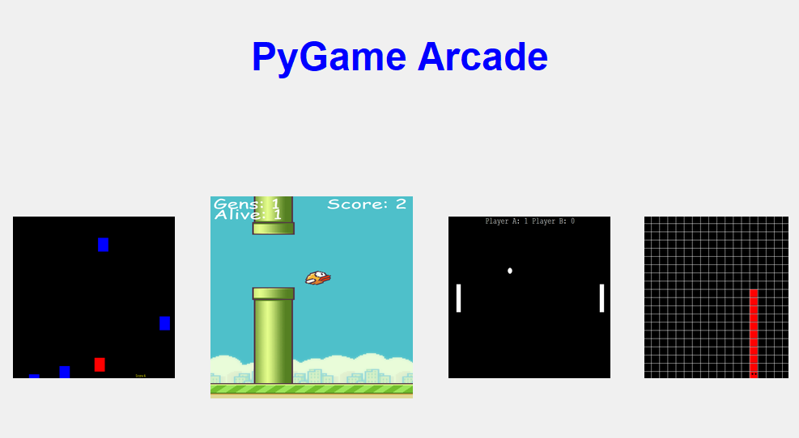
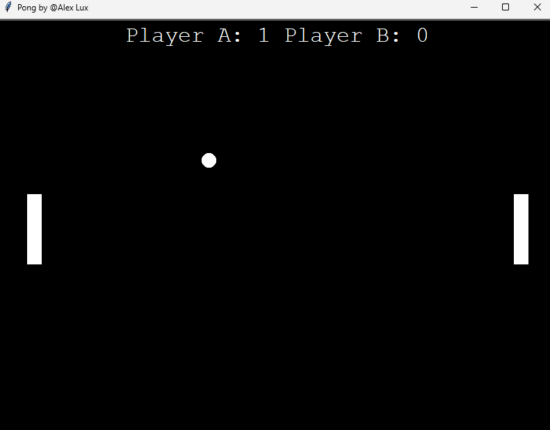
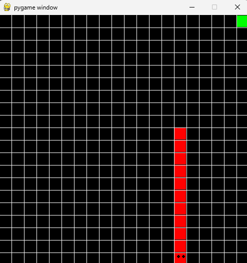
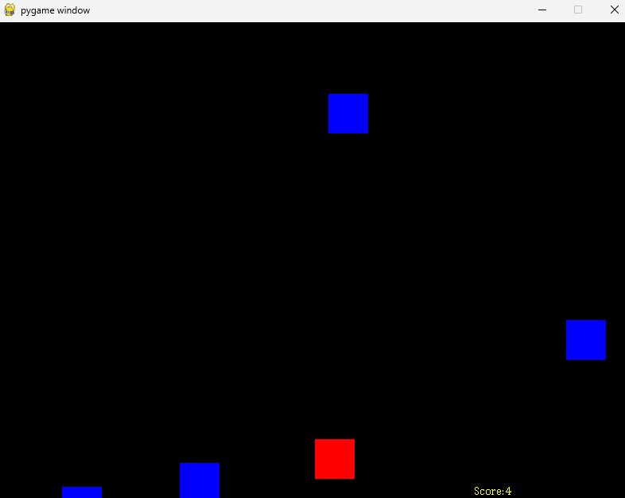

# PyGame Arcade

Welcome to Pygame Arcade, a collection of Python games that you can run from a simple command-line interface or a GUI. Choose your game and let the fun begin!

## Gameplay



<!-- <div style="display: flex; flex-wrap: wrap; justify-content: space-between;">
    
    
    
    
</div> -->

## Table of Contents

- [Setup](#setup)
- [Requirements](#requirements)
- [Usage](#usage)
  - [Command-line Interface](#command-line-interface)
  - [Graphical User Interface](#graphical-user-interface)
- [List Available Games](#list-available-games)
- [Run a Game](#run-a-game)
- [Examples](#examples)
- [Note](#note)

## Setup

To run the Game Selector script, you can follow these steps to set up a virtual environment and install the required packages:

1. Clone the repository to your local machine:

   ```bash
   git clone https://github.com/your_username/Pygame-Arcade.git
   cd Pygame-Arcade
   ```

2. Set up a virtual environment (optional but recommended):

   - On Windows:

     ```bash
     python -m venv venv
     venv\\Scripts\\activate
     ```

   - On macOS/Linux:

     ```bash
     python3 -m venv venv
     source venv/bin/activate
     ```

3. Install the required packages:

   ```bash
   pip install -r requirements.txt
   ```

## Requirements

- Python 3.x

## Usage

You can interact with Pygame Arcade using either the command-line interface or the graphical user interface.

``bash
python game_selector_gui.py

```

### Command-line Interface

Run the script with the desired command-line arguments to list available games or run a specific game.


``bash
python game_selector.py [-h] [-l] [-g game.py]
```

### Command-line Arguments

- `-h`, `--help`: Show the help message and exit.
- `-l`, `--list`: List available games.
- `-g game.py`, `--game game.py`: Run the selected game.

## List Available Games

You can list all the available games by using the `-l` or `--list` option. The script will traverse through the current directory and its subdirectories to find games with the '.py' extension. Games that should not be listed (e.g., 'game_selector.py', 'base.py', 'bird.py', 'neat.py', 'pipe.py') are excluded.

`python game_selector.py -l`

## Run a Game

To run a specific game, use the `-g` or `--game` option followed by the filename of the game you want to play. The game file should be in the '.py' format.

`python game_selector.py -g game.py`

## Running Flappy Bird

If you want to run Flappy Bird, the script will attempt to execute it from the 'FlappyBirdWithAI' directory. If the game file 'flappy_main.py' is found, it will be launched.

Note: Ensure that 'FlappyBirdWithAI' and 'flappy_main.py' exist in the specified directory.

`python game_selector.py`

## Example

List available games:

`python game_selector.py -l`

Run a specific game (replace `game.py` with the actual filename of the game you want to play):

`python game_selector.py -g game.py`

Run Flappy Bird:

`python .\game_selector.py -g flappy_main.py`

## Note

This script relies on the `subprocess` module to execute the games, and it expects the games to be implemented as standalone Python scripts with a '.py' extension.
